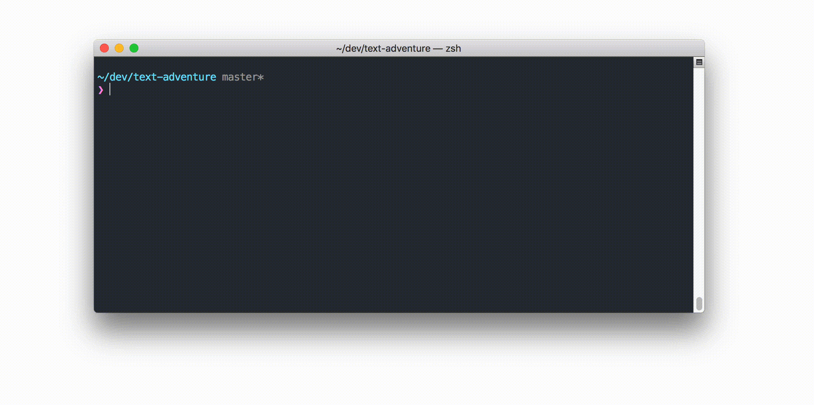

# A Text Adventure in Python

Ideas:

- [ ] Add color to console output
    - colorama package could help with this
- [ ] Define Goal of Game in csv files
    - Possible Goals:
        - Reach special tile
        - Obtain special item
- [ ] Add NPCs

## Tutorial
As my girlfriend wanted to know, how one would go about implementing something like this, I started to assemble a tutorial that covers all the things I used in this project so far. I would say it is targeted towards people who want to learn Python as their first programming language. If you are interested, check it out [here](tutorial/00_Overview).