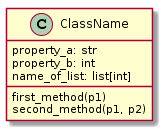

# Building a Text Adventure in Python

The `Textadventure` we are about to build, will let a `Player` navigate a `World` by moving from `Tile` to tile. The world contains `Items`, which the player can put into his `Inventory`.

Although Python is often used as a scripting language, it supports object-oriented programming just as well. To handle the complexity a text adventure will bring with it, we will follow an object-oriented approach. This means that all parts of the code will be grouped into `classes`, from which an `object` (or several objects) will be created, when the game is started. The datatype of an object is its class.

Writing the story should be as independent from the actual game logic as it can be. Therefore, the actual Python code will only contain the elements common to a wide range of text adventures, while the data for a specific adventure will be loaded from `*.csv` files.[^csv] This will force us to think in high-level concepts rather than low-level game details when writing code. Also, you can create your own, personal world while using exactly the code presented in the upcoming chapters. 

## Modeling the game

To display code classes, `uml` diagrams are often used as a way to concisely present properties and methods of a class:

<!-- ```plantuml
@startuml
class ClassName {
    property_a: str
    property_b: int
    name_of_list: list[int]
    first_method(p1)
    second_method(p1, p2)
}
@enduml
``` -->


Each UML class description consists of three elements: the class name, class properties and class methods. By convention, class names always start with uppercase letters, while properties and methods are lowercase. Properties can be further described with their datatype, like _str_ for `string` or _int_ for `integer`.[^typeAnnotation] Methods can have parameters, which are put in braces after the method's name. A method's name combined with its parameters is often referred to as its _signature_.

The main class of the text adventure we would like to build, could look something like this:

<!-- ```plantuml
@startuml
class Textadventure {
    world: World
    player: Player
    main_loop()
}
@enduml
``` -->


We see that the class `Textadventure` holds two properties:

* _world_ of type `World`: reference to an object of class `World`.
* _player_ of type `Player`: reference to an object of class `Player`.

It also has one method `main_loop()`, which does not take any parameters.

# Exercise

Just like the `Textadventure` class above, UML diagrams of the classes below will provide an overview of what class handles which responsibility. Therefore, try to create the UML diagrams for the following classes, based on their descriptions.

## Tile

The `Tile` class provides the basic building block for the `World` out text adventure takes place in. Each tile has a _name_ and a _description_, which are both stored as properties of type `str`. A third property `surrounding` will hold references to its adjacent tiles. The type of `surrounding` will be determined later.

_Solution:_

<!-- ```plantuml
@startuml
class Tile {
    name: str
    description: str
    surrounding
}
@enduml
``` -->


## World

The `World` class holds a reference to all _tiles_ of type `Tile`. These are best organized in a `List`.[^List] It will also provide a method to `load` the csv-file and create tiles based on its contents. 

_Solution:_

<!-- ```plantuml
@startuml
class World {
    tiles: list[Tile]
    load()
}
@enduml
``` -->


## Player

The `Player` class will store the _name_ of the player and keep a reference to the _inventory_ of type `Inventory`. Also, his _current_tile_ should be stored in a property of type `Tile`. To explore the `World`, a `move` method will allow a `Player` to move from the `Tile` saved in _current_tile_ to one of its adjacent tiles. To specify the direction a `Player` wants to move towards, the method should take a _direction_ parameter of type `str`.

_Solution:_

<!-- ```plantuml
@startuml
class Player {
    name: str
    inventory: Inventory
    current_tile: Tile
    move(direction: str)
}
@enduml
``` -->


## Inventory

An inventory system will allow a `Player` to hold several _items_, which might come in handy later in the game. The class `Inventory` therefore needs a property _items_, that manages references to objects of type `Item` in a `list`. Necessary to make the `Inventory` functional are methods to `add` and `remove` an `Item` from the list of _items_ based on its name.

_Solution:_

<!-- ```plantuml
@startuml
class Inventory {
    items: list[Item]
    add(item_name: str)
    remove(item_name: str)
}
@enduml
``` -->


## Item

Last, the class `Item` represents things within the world a `Player` can interact with. For now, it should only hold a _name_ and a _description_ of an item as `strings`.

_Solution:_

<!--
```plantuml
@startuml
class Item {
    name: str
    description: str
}
@enduml
``` -->


<!-- ```plantuml
@startuml

Textadventure  "1" --- "1" World
Textadventure  "1" --- "1" Player
Player "1" *-- "1" Inventory : has
Inventory "1" *-- "n" Item : contains
World "1" *-- "n" Tile : contains

@enduml
``` -->

[^typeAnnotation]: As the datatype `list` can contain arbitrary objects, it is helpful to also note the datatype of the individual list elements, if it is consistent for all elements of the list (which it should be).
[^csv]: Different formats, like `*.json` or `*.yaml` would also have been valid choices. `*.csv` was chosen for its simplicity.
[^List]: ...although later we might replace the list by a more convenient data structure, like a `Dictionary`.