# Writing Code based on UML Specifications

In the last exercise, we created UML diagrams of the `Textadventure`, `Player`, `World`, `Tile`, `Items` and `Inventory` classes our text adventure will be build from. In the following exercise we will learn how to translate this UML description into actual code.

We will begin with creating a stub for the class `Textadventure`. A stub is a piece of code that will later replaced by the actual implementation. It contains the structure of the class without requiring us to think about the logic of the methods and how the class is actually created just yet.

```plantuml
@startuml
class Textadventure {
    world: World
    player: Player
    main_loop()
}
@enduml
``` -->

![UML Representation of class `Textadventure`](01_Intro/01_Intro-1.png)

The UML description of the `Textadventure` class contains two properties _world_ and _player_ and one method _main_loop()_ for now. A straight-forward translation into Python code would look like this:

```py
class Textadventure:

    def __init__(self):
        self.world = World()
        self.player = Player()

    def main_loop(self):
        pass
```

<!-- 


Classes are defined by the `class` keyword[^glossary] followed by its name `Textadventure` and a colon `:`. The colon indicates the beginning of a block of code that belongs together, which is why the next lines are all indented by 4 spaces. Everything below the class definition that is indented with 4 spaces or more belongs to the class `Textadventure`. 

Each class has to contain an `__init__` method which is called when a new object of this class is created.[^constructor] In this method, all properties of the class should be set, in order to guarantee, that they are available as soon as an object of this class is created. Each class method takes `self` as its first parameter, which is a reference to an object of the class it describes. We decided to create objects[^instances] of the classes `World` and `Player`

Sometimes, keeping the method signature more general, i.e. not define the exact number or kind of parameters, is advisable. For this purpose, function and method parameters can contain an arbitrary list of positional and keyword arguments, often named `*args` and `**kwargs`.[^args] A method that takes every positional argument and keyword argument and prints it to `std.out`[^stdout] would look like this:

```py
def show_me_what_you_got(*args, **kwargs):
    print("Positional Arguments: ", args)
    print("Keyword Arguments: ", kwargs)
```

To demonstrate the translation from UML diagram to Python stub one more time, let's also do the `Tile` class.

## Tile

<!-- ```plantuml
@startuml
class Tile {
    name: str
    description: str
    surrounding
}
@enduml
``` -->


As we should know the name and the description of a Tile before it is created, these will be arguments of the `__init__` method, where they are saved as properties of the `Tile` object. As we are not sure yet, how the _surroundings_ are going to be stored, an arbitrary list of positional arguments will be used.

We could either store the `args` list directly or parse the first four arguments in a dictionary, where we define the direction we expect the surrounding tile to be relative to this one. Both implementations are shown below, but the list approach is commented out, as it does not make the relationship between order of arguments and direction, the surrounding tiles are located at, explicit. And as the Zen of Python states:

> Explicit is better than implicit.
[^zen]

```py
class Tile:

    def __init__(self, name: str, description: str, *args)
        self.name = name
        self.description = description
        
        # either save surrounding tiles as list
        # self.surroundings = args
        # ... or save surrounding tiles as dictionary
        self.surroundings = {
            "north" = args[0],
            "east" = args[1],
            "south" = args[2],
            "west" = args[3]
        }

```

## Exercise

Now it is your turn. Translate the remaining UML diagrams of `World`, `Player`, `Inventory` and `Item` into Python code. Note, that each class *has* to contain the `__init__()` method, which is called when an instance of this class is created. Some classes will take arguments when they are created e.g. to set the _name_ of a `Player` from the beginning or tell `World` where to load the information about its tiles from.

### World

<!-- ```plantuml
@startuml
class World {
    tiles: list[Tile]
    load()
}
@enduml
``` -->


**Note:** `World` takes a single parameter _data_ of type `str` which specifies the name of the `csv` file the information about the tiles should be loaded from.

<!-- _Solution:_ -->

## Player

<!-- ```plantuml
@startuml
class Player {
    name: str
    inventory: Inventory
    current_tile: Tile
    move(direction: str)
}
@enduml
``` -->


**Note:** `Player` takes two arguments _name_ and _inventory_size_. Try to add appropiate type hints for both parameters.

<!-- _Solution:_ -->

## Inventory

<!-- ```plantuml
@startuml
class Inventory {
    items: list[Item]
    add(item_name: str)
    remove(item_name: str)
}
@enduml
``` -->


**Note:** Inventory takes a single parameter _size_ of type `int` to specify the number of items an instance of `Inventory` can hold. This parameter should have a default value of `10`, if no size is provided.

<!-- _Solution:_

```py
class Inventory:
    """Hold objects of type `Item` and provide access to these items."""

    def __init__(self, size: int = 10):
        self.items = []
        self.size = size

    def add(self, item: str):
        """Add an item to your inventory."""
        pass

    def remove(self, item: str):
        """Remove an item from your inventory."""
        pass
``` -->

## Item

<!--
```plantuml
@startuml
class Item {
    name: str
    description: str
}
@enduml
``` -->


**Note:** Each `Item` will take its _name_ and _description_ upon creation. Also include type hints for both parameters.

<!-- _Solution:_

```py
class Item:
"""An item represents an object in the `Inventory`."""

    def __init__(self, name: str, description: str):
        self.name = name
        self.description = description
``` -->

<!-- ```plantuml
@startuml

Textadventure  "1" --- "1" World
Textadventure  "1" --- "1" Player
Player "1" *-- "1" Inventory : has
Inventory "1" *-- "n" Item : contains
World "1" *-- "n" Tile : contains

@enduml
``` -->

[^glossary]: The [python glossary](https://docs.python.org/3/glossary.html) provides definitions for the most important terms.
[^constructor]: This is called the classes' constructor.
[^args]: While the name `args` and `kwargs` are arbitrary and can be renamed, the `*` for positional and the `**` for keyword arguments are required.
[^stdout]: This means the standard output stream. Usually, this is the terminal / command line the program is launched from.
[^instances]: also referred to as _instances_ of a class.
[^zen]: The Zen of Python can be explored by typing `import this` into any Python interpreter.